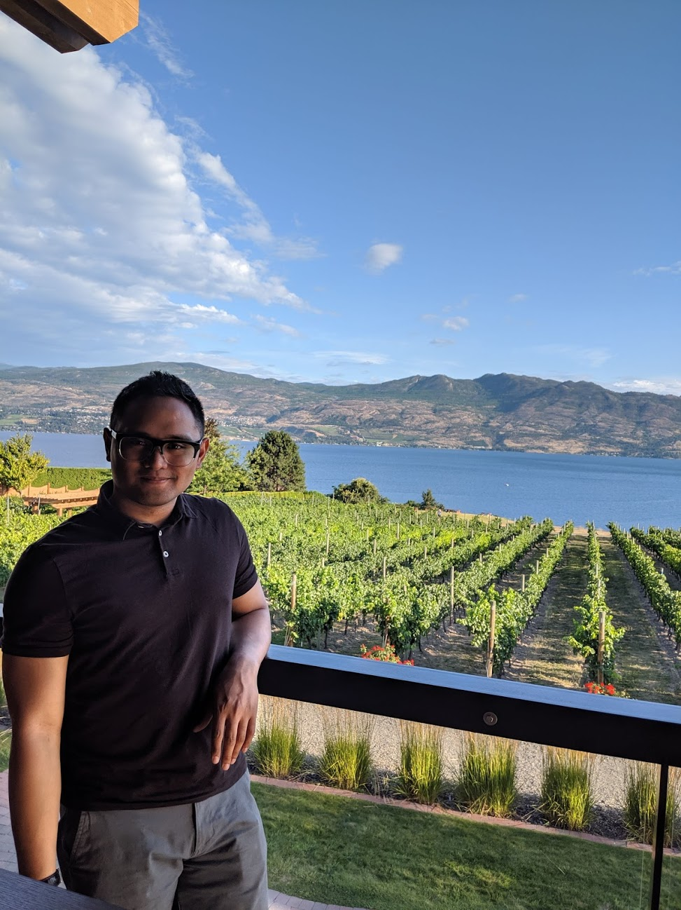

_Me posing in a BC Okanagan winery._

I really, really liked Ruby on Rails and made several projects with rails.
But that was my past love. Now, my new love is with React.
I now develop all my web apps with React.
I have used these CSS frameworks: Bootstrap, Reactstrap, Ant Design and Material UI.
Material UI to me is the simplest and most elegant to use.

I am very friendly. I tend to be the smiley guy in the room.
I don't shy away from conversations that I need to have.
I don't see coding as a job. To me, coding is my passion and my career.
Coding, coding, coding. It's just something I do.
Paid or not, I am going to be doing it no matter what.
I have tons of ideas and bringing them to life would be an adventure full of learning, with a side of procrastinating.
