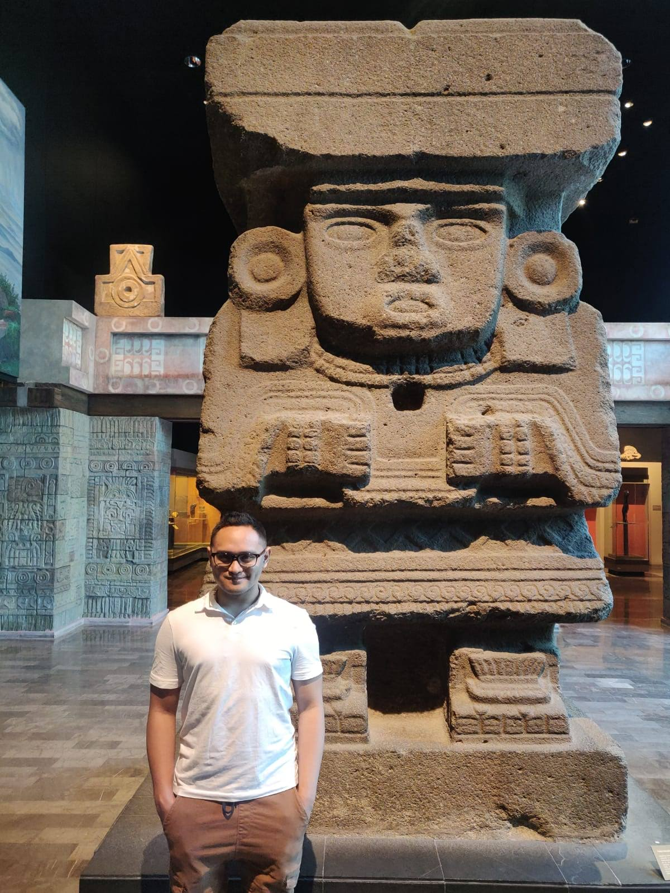

_Me and the Aztec water goddess Chalchiuhtlicue (Chal-CHEE-ooh-tlee-quay)._  
_The world destroyer._

The goddess ruled over and destroyed the previous world, known in Aztec mythology as the Fourth Sun.
After 676 years, Chalchiutlicue destroyed that world in a cataclysmic flood.
The current world is the Fifth Sun based on the Aztec universe.
Our Teotihuacan tour guide said an original water god statue was in the Mexican national museum. I found her! <a href="https://www.thoughtco.com/chalchiuhtlicue-goddess-170327" target="_blank" rel="noopener noreferrer">
[source]</a>

The goddes and I are two opposites. Yin and yang. Good and bad.
I create websites. Applications. Software. Worlds.
I create worlds. While Chalchiuhtlicue destroys them.
We don't belong together, but we are a balance.

I really, really liked Ruby on Rails and made several projects with rails.
But that was my past love. Now, my new love is with React.
I now develop all my web apps with React.
I have used these CSS frameworks: Bootstrap, Reactstrap, Ant Design and Material UI.
Material UI to me is the simplest and most elegant to use.

I am very friendly. I tend to be the smiley guy in the room.
I don't shy away from conversations that I need to have.
I don't see coding as a job. To me, coding is my passion and my career.
Coding, coding, coding. It's just something I do.
Paid or not, I am going to be doing it no matter what.
I have tons of ideas and bringing them to life would be an adventure full of learning, with a side of procrastination.
