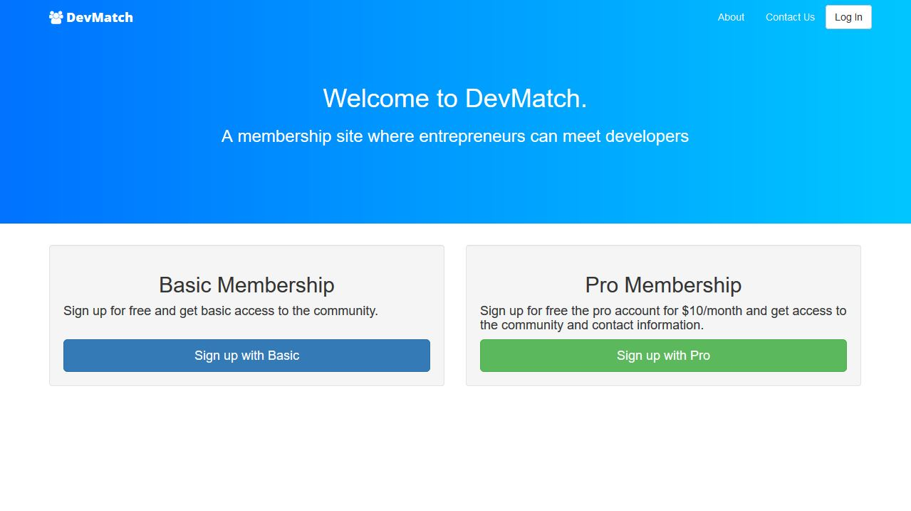

<a href="http://pacific-mesa-35161.herokuapp.com/" target="_blank" rel="noopener noreferrer">
    Link to site.
</a>

<h1>Fullstack Developer</h1>

A membership site where entrepreneurs can meet developers.
Made with Ruby on Rails. Has a pro membership which you pay through Stripe API.
