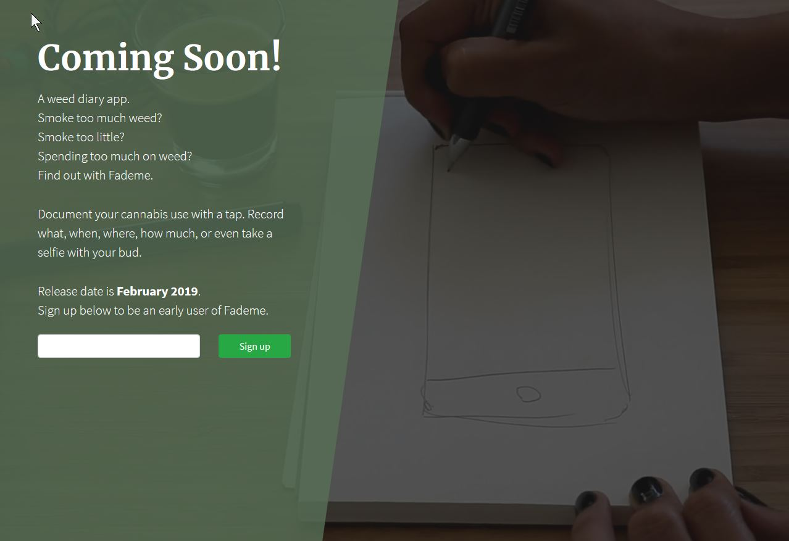

<a href="https://fademe.herokuapp.com/" target="_blank" rel="noopener noreferrer">
    Link to site.
</a>

<h1>Frontend Developer</h1>

Made a landing page for a weed app. Practiced email subscription.
Emails handled by mailchimp API.
