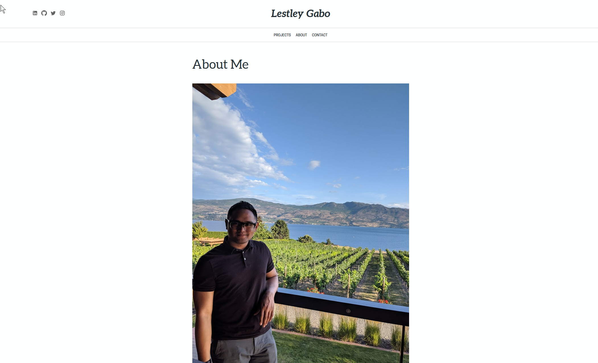

<a href="https://www.lestley.com/" target="_blank" rel="noopener noreferrer">
    Link to site.
</a>

<h1>Frontend Developer</h1>

Created portfolio using Gatsby. Gatsby is a React based static site generator.
Understood how to use Gatsby themes and customize them to my own designs through shadowing.
Shadowing is the term used when overriding a theme's components.
