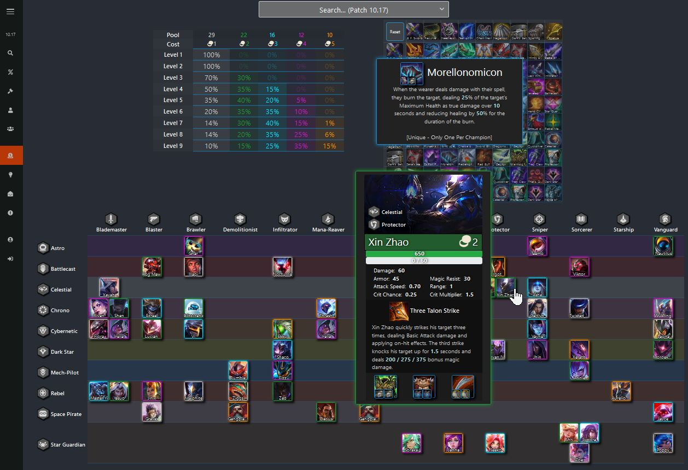

<a href="https://www.tft-helper.com/" target="_blank" rel="noopener noreferrer">
    Link to site.
</a>

<h1>Fullstack Developer</h1>

Designed and developed a cheat sheet using React and JavaScript, an up-to-date cheat sheet for Teamfight Tactics (TFT), helping hundreds of daily
users plan their teams and plan which items to give their champions Initialized data by mapping and filtering League of Legends data from
CommunityDragon, an open-source API Mapped data to form an item table and champ table each with dynamically updated descriptions from the API
Connected app to a Firebase database allowing for sign-up/sign-in and implemented a payment subscription Cut load time from 4s to 0.5s by code
splitting, implementing Redux, adding unique keys to elements, and understanding a react-tooltip library, a 3rd party API heavily used by the app,
enabling targeted rendering
