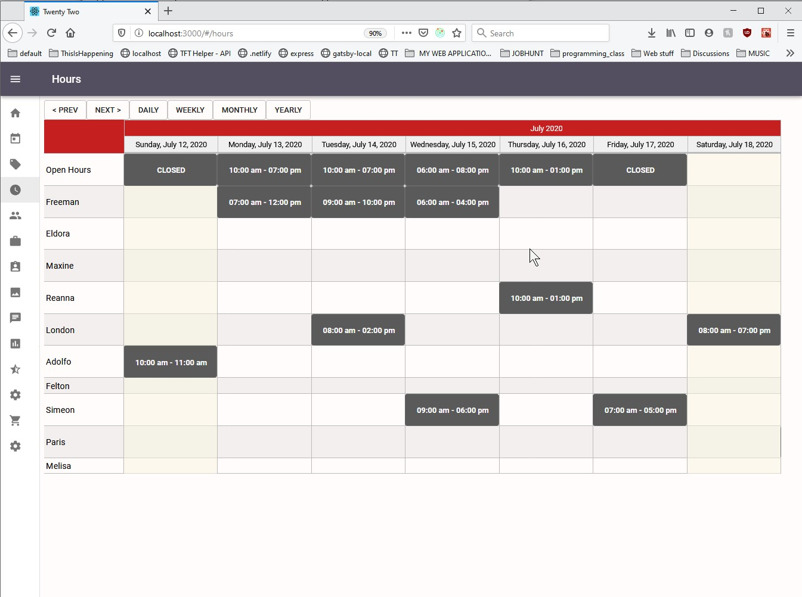

<em>I need to contact former boss to see if I am allowed to show their site.</em>

<h1>Frontend Developer</h1>

Followed designs and specifications to create several frontend pages for a startup MVP.
Developed CRUD (create, read, update, delete) API for staff page, client page, company page, and hours page.
Created from scratch the hours page which allows admin to use CRUD for staff and store hours and time off.
Communicated with backend developer to determine which internal APIs needed to be used to connect to the MongoDB backend, therefore was able to integrate my frontend with the custom backend.
